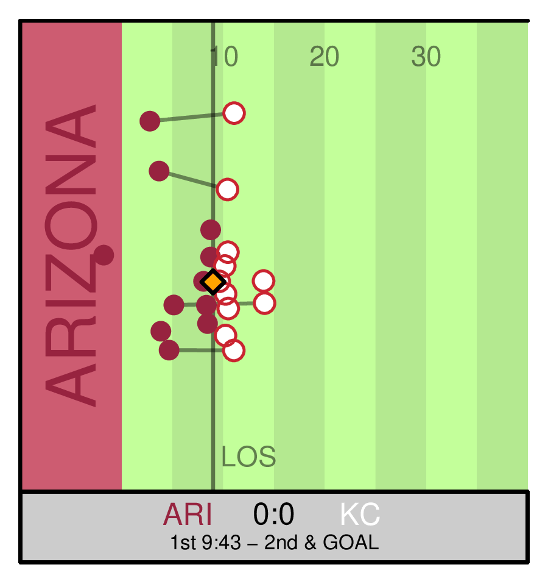

```{r setup, echo = FALSE, warning=FALSE, message=FALSE, include=FALSE}
knitr::opts_chunk$set(
  echo = TRUE
)
```


# HMMotion: Using tracking data to predict coverage strategies in American Football 

This is the github repository for the corresponding submission to the NFL Big Data Bowl 2024 competition on Kaggle. The full notebook can be viewed [here](https://www.kaggle.com/code/rouvenmichels/hmmotion-using-tracking-data-to-predict-coverage).

## Quick Summary

<center>

</center>


## Code Information


