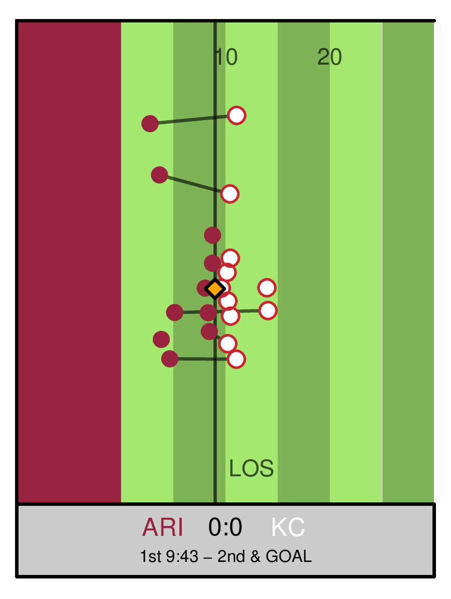

# HMMotion: Using tracking data to predict coverage strategies in American Football 

This is the github repository for the corresponding submission to the
NFL Big Data Bowl 2025 competition on Kaggle. The full notebook can be
viewed
[here](https://www.kaggle.com/code/rouvenmichels/hmmotion-using-tracking-data-to-predict-coverage).

## Quick Summary

In this project, we focused on incorporating pre-snap motion information
into the prediction of the coverage scheme, i.e. man or zone-coverage.
Specifically, we developed a hidden Markov model (HMM) to infer the
latent guarding assignments based on the movement of the defenders in
response to all offenders. We show that incorporating the informaton
obtained from decoding the hidden guarding assignments can improve the
predictive power of the coverage scheme.

## Code Information
