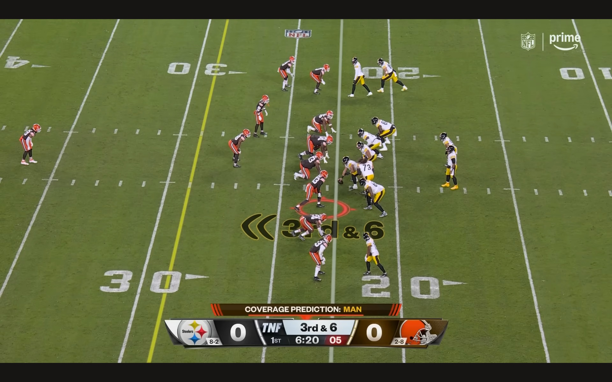
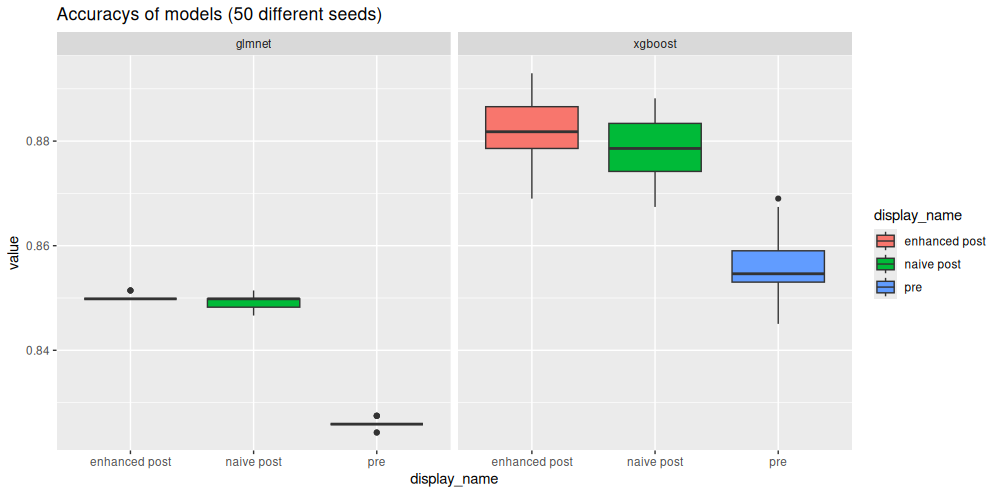
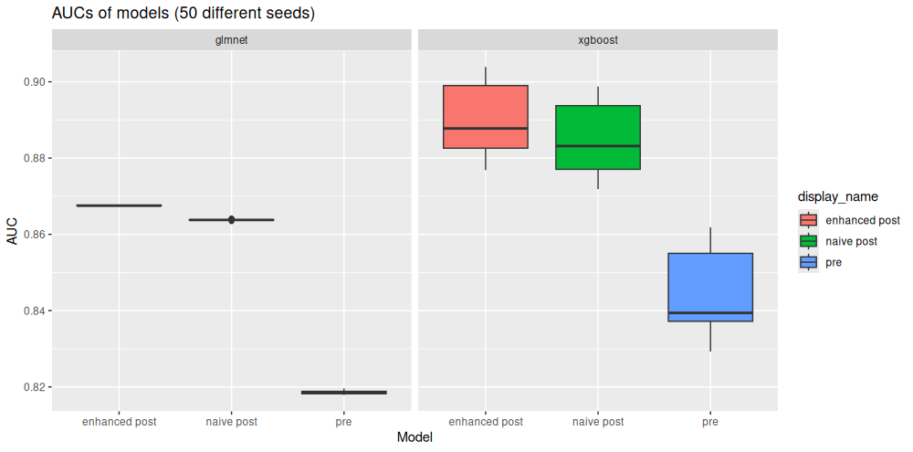
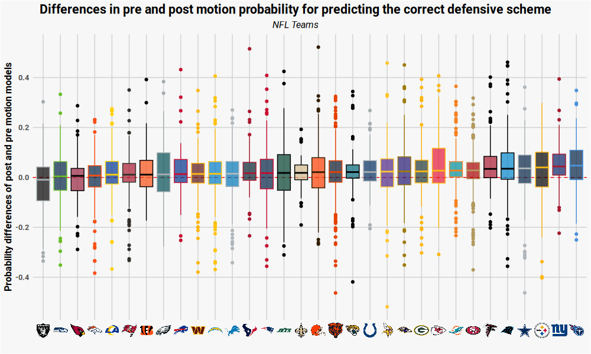
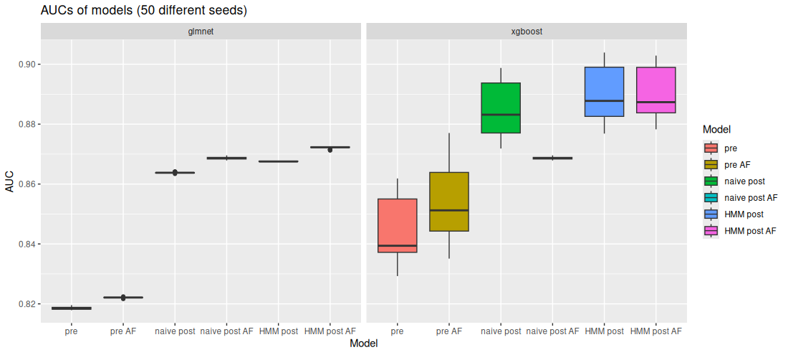
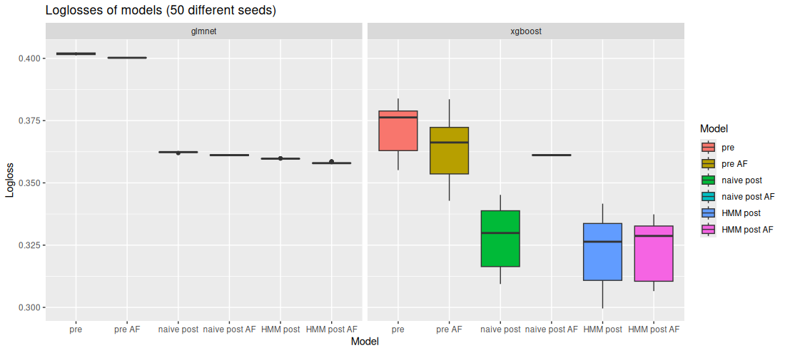

#### <span style="color: grey;"> Submission to metric track </span>

```{r colorize,echo=FALSE}
#| echo: false
# colorize text: use inline as `r colorize(text, color)` to print `text` in a given `color`
# can also be used to color a color name, as in r colorize("red")`
colorize <- function(text, color) {
  if (missing(color)) color <- text
  if (knitr::is_latex_output()) {
    sprintf("\\textcolor{%s}{%s}", color, text)
  } else if (knitr::is_html_output()) {
    sprintf("<span style='color: %s;'>%s</span>", color, text)
  } else text
}
```

```{r setup, echo = FALSE, warning=FALSE, message=FALSE, include=FALSE}
knitr::opts_chunk$set(echo = TRUE)
```

## Introduction
Deciding between man and zone coverage is one of the most critical strategic decisions a defensive coordinator must take before each offensive play in American football. While experienced offensive coordinators and quarterbacks often rely on visual cues to identify these defensive schemes, the increasing availability of player tracking data offers a new avenue to uncover and analyze these tactics. A notable example is Amazon's NFL Next Gen Stats model, which delivers coverage predictions during live broadcasts (see a snapshot of the 2024 Week 12 match between the Pittsburgh Steelers and Cleveland Browns). However, in these pre-snap motion does not seem to play an accentuated role (see [Amazon](https://aws.amazon.com/de/blogs/machine-learning/identifying-defense-coverage-schemes-in-nfls-next-gen-stats/)), although it is a crucial element of modern offensive strategies and it is often used to detect the hidden defensive scheme. 

Hence, our project goes one step further. While we similarly predict man- or zone coverage when the teams are set before snaps, we further leverage the additional information of pre-snap player movements in a specific manner. For this, we first include rather naive post-motion features. Afterwards, we use a hidden Markov model (HMM) to model defenders' trajectories based on hidden states, which represent the offensive players they may be guarding. Incorporating summary statistics of the state decoding results as features into the existing models significantly improves the predictive ability. This opens up the avenue for further analysis such as the evaluation of the effectiveness of pre-snap motion in uncovering defensive strategies.

<center>
  
</center>

## Data

We aim to forecast the defensive scheme (man- or zone defense) using the `pff_passCoverage` indicator in play-by play data. We omit plays tagged as \textit{others} as well as plays with more than five offensive linemen and with two quarterbacks. Since we are specifically interested in analyzing pre-snap player movements, we concentrate on plays that contain any pre-snap motion. Then, we end up with $3985$ offensive plays in total, from which the defense played $2973$ in zone and $1012$ in man coverage. 

<!--We analyze tracking data from the first nine weeks of the NFL 2022 season, provided by the NFL Big Data Bowl 2024. Moreover, we use play-by-play data and the corresponding data from PFF that assigned the categories \textit{man}, \textit{zone} and \textit{others} representing the different schemes to each play. As it is not properly described what \textit{others} means, we omit every play that is associated with this value. We also omit plays with more than five offensive linemen and with two quarterbacks. Since we are specifically interested in analyzing pre-snap player movements, we concentrate on plays that contain any pre-snap motion. Then, we end up with $3985$ offensive plays in total, from which the defense played $2973$ in zone and $1012$ in man coverage. -->

##### Feature engineering

To accurately forecast the defensive scheme (man- or zone defense) for every play, we create various features derived from the tracking data. In particular, we conducted the following feature engineering steps: First, using all 11 players on each side, we compute the area spanned by the convex hull of a team as well as the largest $y$ distance (i.e.\ the width of the hull) and the largest $x$ distance (i.e. the length of the hull). Then, we select the five most relevant players on each side of the field. For offense, we omit the offensive line and the QB, thus coming up with five players that are a composition of running backs, tight ends and wide receivers. In contrast, for defense, disregarding defense liners (NT, DT, DE), we select the five defenders that were the closest to the five offensive players, corresponding to a weighted euclidean distance, putting much more emphasis on the y-axis. or these 10 players, we extract features related to their (standardized) position, distance and orientation.

<!--
For all 11 players on each side of the field we compute features related to the convex hull of the positions of the players. In particular, for defense and offense, we compute the area spanned by the convex hull of all player such as well as the largest $y$ distance (i.e.\ the width of the hull) and the largest $x$ distance (i.e. the length of the hull). In addition, we select the five most relevant players on each side of the field. For offense, we omit the offensive line and the QB, thus coming up with five players that are a composition of running backs, tight ends and wide receivers. In contrast, for defense, we omit nose tackles, defensive tackles and defensive ends, and select the five defenders that were the closest to the five offensive players, corresponding to a weighted euclidean distance, putting much more emphasis on the y-axis. 
For these 10 players, we extract features related to their (standardized) position, distance and orientation.
<!--
Finally, we use their standardized $x$ and $y$ coordinates as features and order defensive and offensive players according to their $y$ coordinates. Additionally, for each of the relevant defenders, we compute distances to the football and their orientation with respect to the quarterback. 
-->
Finally, we extract relevant information from play-by-play data, such as quarter, down, yards to go, home and away score and the remaining game time in the current half (in seconds). 

More detailed information can be found in the Appendix.

## Analysis 

<!-- NEW STRUCTURE -->

We train different models to predict whether the defense plays a man- or zone coverage scheme. Since the aim of the project is to show the effectiveness of pre-snap motion, we follow a three-step approach:

1. Pre-motion models
2. Naive post-motion models
3. HMM post-motion models

In general, we have a limited dataset available (only 3985 plays) and therefore need to balance the complexity of the model, thus aiming to control the number of features. Given the small dataset, we focus on 32 previously described basic features used in all 3 models: 6 convex hull related features, 20 player features, and 6 play-by-play features. In the Appendix, we provide a discussion on the choice of features.

<!--
`r colorize("der erste Teil ist doch eigentlich eine Wiederholung des Feature Engeneerings?","red")`
In general, we have a limited dataset available (only 3985 plays) and therefore need to balance the complexity of the model, thus aiming to control the number of features. Given the small dataset, we focus on 32 previously described basic features used in all 3 models: 6 convex hull related features (3 for offense and defense, respectively), 20 player positions features (10 standardized $x$ and $y$ coordinates, 5 for offense, 5 for defense), and 6 play-by-play features. In the Appendix, we provide a discussion on the choice of features. <!--we provide more details and analyses using more features. -->

#### 1. Pre-motion models

First of all, we need a suitable basic model class for predicting man or zone coverage and opt for the following two: First, we fit a `glmnet` (elastic net) model, which performs implicit feature selection and is able to handle multicollinearity. Second, we use an `xgboost` model, which is able to capture non-linear effects (and interactions) and also handles multicollinearity. However, it necessitates careful hyperparameter tuning and generally performs better on bigger data sets. For all of the models, we use 10-fold cross validation on a suitable hyperparameter grid. `r colorize("Ich finde der Teil ist besser in der Einleitung zur Analyse, da wir die zwei Modellklassen ja für alle 3 Modelle verwenden. Daher auch nochmal die Beschreibung der Features oben, weil die 32 features sind einfach für alle Modell gleich.","red")`

We fit the models with the previously described basic features. All of these features are derived at the time of line-set, which is why these models do not use any pre-snap motion information. These very basic models serve as baseline models that allows to measure the effect of pre-snap motion (features) in the following.

#### 2. Naive post-motion models

In a second step, we extend our basic pre-motion model with naive post-motion features. To keep the complexity manageable, we derive only 6 additional post-motion features: for each team (offense and defense), we infer the maximum $y$-distance, the maximum $x$-distance and the total distance traveled by both teams until the snap.

#### 3. HMM post-motion models

##### 3.1 Hidden Markov model

The last step is as the heart of our approach. In particular, we use results from a hidden Markov model as further features in the previously described models. For this, we describe the movements of the five defensive players during the phase of pre-snap motion by an HMM (see the Appendix for an in-depth description). In particular, we assume that each defender's $y$-coordinate at each time point $t$ is a realization from a particular Gaussian distribution with mean according to the $y$-coordinate of the offensive player that is currently guarded and an estimated standard deviation. HMMs are particularly useful in this setting as there is no direct knowledge of the guarding allocation. This is only partially observed based on the reaction of the defender to the offenders' movement. Naturally, the model thus treats the information on who is currently guarded as a latent state variable, and hence each observation as a realization from a mixture of Gaussian distributions (see Franks et al. 2015 for a similar approach in basketball).
Ultimately, the goal is to use the fitted model for so-called *state-decoding*, i.e. inferring information on the guarding allocation based on the observations made. For this task, HMMs not only leverage information on the $y$-coordinates of the defender and all offenders potentially guarded at each time point, but also incorporate probabilistic information based on the previous and subsequent observations. For practical details on the model fitting and state decoding, also see the Appendix.

The results of the HMM are exemplified using the following video. It displays a touchdown from the Kansas City Chiefs against the Arizona Cardinals in Week 1 of the 2022 NFL season. We can see that, pre-snap, Mecole Hardman (KC #17) is in motion. He is immediately followed by the defender Marco Wilson (AZ #20), which is a clear indication for man-coverage. 

<center>
<video width="600" height="400" controls>
  <source src="kc_az_td.mp4" type="video/mp4">
</video>
</center>


When performing state decoding, it becomes evident that the HMM effectively captures Marco Wilson's guarding assignment. The unique strength of HMMs is particularly apparent when Marco Wilson reaches the same height as the running back, Jerick McKinnon (KC #1). At this point, clustering algorithms that disregard the temporal component would briefly suggest a change in the guarding assignment, introducing noise into summary statistics such as the total number of switches predicted by the model. In contrast, the HMM consistently and accurately maintains the correct coverage assignment throughout the motion.

<center>
  
</center>


##### 3.2 Enhanced post-motion model
We re-train the post-motion model to predict whether the defense plays a man- or zone coverage scheme, but, in this step, we incorporate results from the HMM analysis as further features. However, a caveat of the aforemententioned state probabilities is that they constitute as high-dimensional time-series data which makes them hard to use as features in the previously described models. An outlet of this problem is to employ suitable summary statistics. To overcome this, we first calculate for each defender the most likely offensive player $k = 1, \ldots, 5$ to be guarded in each time point $t = 1, \ldots, T_n$, where $T_n$ is the length of the $n$-th play, and count the number of state switches, i.e. the number of times for which a defender's most likely guarded offensive players differs between two consecutive time points $s$ and $t$, $s>t$. From this, we can calculate some simple, summary statistics: 1) the sum of state switches, 2) the average number of state switches and 3) the number of defenders that switch offensive players during a play. Fourth, we use the aforementioned state decodings to calculate a more elaborated statistic, the mean entropy across defenders $j = 1, \ldots, 5$ in each offensive play $n = 1,\ldots, N$, i.e.: 

$$H(n) = - \frac{1}{5}\sum_{j = 1}^5 \sum_{k=1}^{5} \left( \frac{1}{T_n} \sum_{t=1}^{T_n} \mathbb{1}\left(\arg\max_{i=1,\ldots,5} X_{t,i} = k\right) \cdot \log\left(\frac{1}{T_n} \sum_{t=1}^{T_n} \mathbb{1}\left(\arg\max_{i=1,\ldots,5} X_{t,i} = k\right)\right) \right),$$

as the entropy is a measure of uncertainty or randomness in a probability distribution. Higher entropy indicates greater unpredictability, while lower entropy signifies more predictability.

## Results

#### Model and feature evaluation

We compare the predictive performance of our three models to determine the effectiveness of player movements before snap for detecting the correct defensive scheme. We train our the models on 85% of the data and evaluate performance on the remaining 15%. Since we use cross-validation for tuning of the models during the training phase, we perform our evaluation repeatedly. We use 50 repetition each time splitting the data differently, and for each we tune and train a model and then evaluate the performance on the test set. We do this to ensure that our results are meaningful and not due to chance (especially in our small data set).




The plots above show the results for our 50 repetitions of the experiment. First, we show the classification accuracy, when using a threshold of 50\%. Since this is an arbitrary value and our data is slightly imbalanced ($\approx$ 75\% zone coverage plays and $\approx$ 25\% man coverage plays), accuracy is not the best metric for analyzing the results. Therefore, we also present the AUC values of the model (see Appendix for a discussion on evaluation metrics). For both metrics, we notice a few things. On the one hand, the more flexible `xgboost` model performs better than the `glmnet`. However, there is more variation for the `xgboost` model, suggesting that more data would help improve the tuning of the models. On the other hand, the pre-motion model clearly performs worst. As soon as we incorporate motion information, there is a large increase in performance. While this is expected, we also see that the HMM post-motion model outperforms the model with only naive post-motion information. This shows that the HMM features capture information, which is distinct from simple motion features and provide another dimension of information, which needs to be incorporated.  

#### Team analyses



Main findings:

Plot: In general, motion improves the correct detection of coverage (median of most teams positive). Table: Giants (Titans) --> low number of motions but very effective 49 out of 60 (82 %) of the motion plays increased coverage detections. Miami, Atlanta, SF --> Extensive use of motion but still very effective. Raider, Seattle, Rams --> Substantial use of motion but very ineffective. Bills (Bengals) -->  little use of motion and also ineffective.
`r colorize("Rouven, wenn Du es schaffst einen netten text zu den Findings zu verfassen wäre es super!","red")`


```{r team_tab, echo = FALSE, warning=FALSE, message=FALSE}

library(tidyverse)
library(reactable)
library(reactablefmtr)
library(scales)

team_info <- readRDS("team_tab.rds")

make_pal <- function(value,col_low = "red",col_middle = "skyblue",col_high = "darkgreen",nq = 10){
  colourer <- col_quantile(
    palette = c(col_low,col_middle,col_high),
    domain = c(min(value), max(value)),
    n = nq)
  colourer(value)
}

team_pals <- team_info |> 
  mutate(col1 = make_pal(n),
         col2 = make_pal(n_improv),
         col3 = make_pal(prop_improv))

reactable(team_info |> select(url,n,n_improv,prop_improv),
          bordered = TRUE,
          defaultSorted = "prop_improv",
          defaultSortOrder = "desc",
          
          columns = list(
            url = colDef(
              name = "Team",
              maxWidth = 70,
              align = "center",
              cell = embed_img(height = 25, width = 40)
            ),
            n = colDef(
              name = "# Motions",
              format = colFormat(digits = 0),
              style = color_scales(team_pals, color_ref = "col1"),
              maxWidth = 90
            ),
            n_improv = colDef(
              name = "# Plays with improved probability of predicting correct defensive scheme in post motion model",
              format = colFormat(digits = 0),
              style = color_scales(team_pals, color_ref = "col2")
            ),
            prop_improv = colDef(
              name = "Percentation of plays with improved probability of predicting correct defensive scheme in post motion model",
              format = colFormat(digits = 2),
              style = color_scales(team_pals, color_ref = "col3")
            )
          #   avg_per_tackle2 = colDef(
          #     name = "Avg PEP[2]",
          #     format = colFormat(digits = 2),
          #     style = color_scales(best_tacklers_u, color_ref = "col4"),
          #     maxWidth = 80
          #   )
          )
          
)

```


## Discussion

While we were clearly able to show that pre-snap motion facilitates the defensive coverage scheme detection, a limitation of our approach lies in the imperfect prediction accuracy of the pre-motion model, primarily due to insufficient hyperparameter tuning and the relatively small number of plays involving motion. `r colorize("Ich würde nicht mit limitations anfangen sondern mit dem was wir gezeigt haben. Außerdem sollte man das insufficient hyperparameter tuning weglassen und nur auf den kleinen Datensatz fokussieren. Wir tunen gut genug und es liegt auch am Datensatz, dass wir nicht mehr machen.","red")` However, the primary focus of this project was on pre-snap motion, particularly on how to effectively translate this information into the hidden Markov model. Importantly, our HMM approach is modular and can be seamlessly replaced by another model, such as the NFL Next Gen Stats model, in the case of a richer data set. Combining both of these worlds could fully leverage the insights provided by the present data.

## Code

All code for data pre-processing, model training, prediction and player evaluation can be found [here](https://github.com/janoleko/BDB-2025/).

## References
*Franks A, Miller A, Bornn L, Goldsberry K (2015). Characterizing the Spatial Structure of Defensive Skill in Professional Basketball. The Annals of Applied Statistics, 9(1), DOI:10.1214/14-AOAS799

*Koslik J (2024). LaMa: Fast Numerical Maximum Likelihood Estimation for Latent Markov Models. R package version 2.0.2, <https://CRAN.R-project.org/package=LaMa>.

*Zucchini W, MacDonald I, Langrock R (2016). Hidden Markov Models for Time Series - An Introduction Using R. CRC Press

## Appendix

#### Feature engineering

Prior to more involved feature engeneering steps, we transform the coordinate system by redefining the x-variable as the x-distance to the endzone (such that all play directions are from right to left and the relevant endzone is at zero), and changing the direction variable, such that zero degrees represents heading straight towards the corresponding endzone. As mentioned in the main text, we use player features from 5 defensive and 5 offensive player. First, we standardized their $x$ and $y$ coordinates with respect to the football and order the players according to their $y$ coordinates. That is the the first defender in our dataset is always the leftmost defensive player, while the first offensive player is always the rightmost one (offensive play direction is from left to right). Furthermore, for each player we compute distances to the football and their orientation with respect to the quarterback.

#### Model features and comparison

As frequently mentioned, we face the problem of having only a small amount of relevant data available. In order to avoid overfitting problems, we therefore focus on a basic features set of 32 variables for our main results: 6 convex hull related features (3 for offense and defense, respectively), 20 player positions features (10 standardized $x$ and $y$ coordinates, 5 for offense, 5 for defense), and 6 play-by-play features. However, using more thoroughly crafted features such as distances and orientation as described above, we can enlarge the feature set to 67 total variables: 30 distance variables (for each of the 10 relevant players the total distance, $x$-distances, and $y$-distances to the football), and 5 orientation variables (for each defender the orientation with respect to the QB). 

In the following, we provide a comparison of these enlarged models and the smaller ones used for our main results. When comparing results of a binary outcome variable, accuracy can be a misleading metric, since it is dependent on the threshold selected for classification of the outcome. Usually, for probabilistic predictions as obtained by the two model classes considered, one uses the naive threshold of 0.5. However doing so is arbitrary and especially for imbalanced data, changing the threshold may change the results of the accuracy drastically. AUC (or area under the ROC curve) on the other hand, tries to evaluated the performance of a model over a suitable grid of thresholds, and is thus avoids the subjective choice of threshold. Another popularly used metric is the logloss (or negative log-likelihood loss), which is often a preferred choice due to being a proper scoring rule (mathematically speaking a scoring rule is proper, if it is optimal in expectation under the true probability). While using the logloss as evaluation metric is mathematically the best option, interpretation is not as intuitive. Specifically, whether a logloss of a model can be considered good, depends on the (im)balance of the classes (as well as the number of classes, which in a our binary case is only 2). We will therefore focus on these two metrics for the evaluation of the models.    




We see that using the more pronounced set of features (models contain "AF" in the name) seems to provide more information. At least the `glmnet` model, which is more simple but known to be able to handle a high number of features well, the versions including a bigger set of features (orientations and distances) performs better than the corresponding smaller models. For the `xgboost` model, the model including all features performs on par with the one including only small set of basic features. This suggests, that with more data the model may still be improved. 

Finally, we mention that we also varied the number of players used in the analyses. Presently, we use only information of 5 offensive and 5 defensive players. However, using more information resulted in worse performance of the models, thus we refrain from showing the results here. 


#### Hidden Markov model

A hidden Markov model consists of an observed time series $\{y_t\}_{t=1}^T$ and an unobserved first-order Markov chain $\{ g_t\}_{t=1}^T$, with $g_t \in \{1,\ldots,N\}$. In this case, at every time point $t$, $y_t$ is the y-coordinate of the defensive player and $g_t$ proxies the offensives player to be guarded, i.e. the guarding allocation. 
The Markov chain is fully described by an initial distribution $\boldsymbol{\delta}^{(1)} = \bigl( \Pr(g_1=1), \ldots, \Pr(g_1=N) \bigr)$ and a transition probability matrix (t.p.m.) $\boldsymbol{\Gamma} = (\gamma_{ij})$, with $\gamma_{ij} = \Pr(g_t = j \mid g_{t-1} = i), \ i,j = 1, \ldots, N$. The connection of both stochastic processes arises from the assumption that the distribution of the observations $y_t$ are fully determined by the state that is currently active. More formally,
\begin{equation*}
f(y_t \mid g_1, \ldots, g_T, y_1, \ldots, y_{t-1},y_{t+1},\ldots,y_T) = f(y_t \mid g_t = j), \qquad j \in \{1, \ldots, N\},
\end{equation*}
which we denote by $f_j(y_t)$ in short.
In general, $f_j$ can be any density or probability mass function depending on the type of data and a typical choice is a parametric distribution with separate parameters for each latent state. Following the approaches of Franks et al. (2015), we opt for a Gaussian distribution with a mean that is fully determined by the current $y$-coordinate of defender $j \in \{1, \dots, N\}$ and a standard deviation that is fixed across all states but estimated from the data.

To fit the model, we use direct numerical likelihood maximization. The HMM likelihood for the motion of a specific defender in a specific play can be calculated based on the so-called *forward algorithm*. It effectively performs a summation over all possible latent state sequences in an efficient manner, rendering the computational complexity linear in the number of observations. Time series of different defenders within the same play, and of different plays are treated as independent, hence their likelihood contributions are summed to obtain the full likelihood of the training data. For practical implementation, we wrote a custom likelihood function in R, using the function `forward()` and other convenience functions from the R package `LaMa` (Koslik, 2024) to speed up computations. Furthermore, we used the R package `RTMB` to make this likelihood function compatible with automatic differentiation, making the numerical optimization process more efficient and robust. 
The parameters to be estimated are only the transition probability matrix $\boldsymbol{\Gamma}$ and the standard deviation of the Gaussian distribution. 
The initial distribution of each defender for each play comes from a deterministic assignment approach based on spatial proximity of the initial y-coordinates at the beginning of the time-series, i.e. the moment the line is set. Specifically, for each defender in a predefined set of potential defenders, we calculated their Euclidean distances to the five offensive players For each offense player, ranked in descending order by proximity, we assigned the closest defender to that player. The initial distribution was then set as a categorical distribution, where each defender was assigned a probability of 1 for their corresponding attacker and 0 for all others. 

Having fitted an HMM to the data, we can use the model to predict the underlying state sequence based on the observations. This process is called state decoding and two main approaches exist. So-called *local decoding* constructs the conditional distributions
$$
\Pr(g_t = j \mid y_1, \dots, y_T)
$$
while *global decoding* using the *Viterbi-algorithm* finds the state sequence that maximizes the joint probability of the state sequence given the observations. Local decoding retains more probabilistic information as it provides a categorical state distribution for each time point while global decoding is more suitable for visualization purposes as it provides a single state sequence that is most likely to have generated the observations.
To obtain both the local state probabilities and the global state sequence, we used the functions `stateprobs()` and `viterbi()` that are also contained in the R package `LaMa`.
