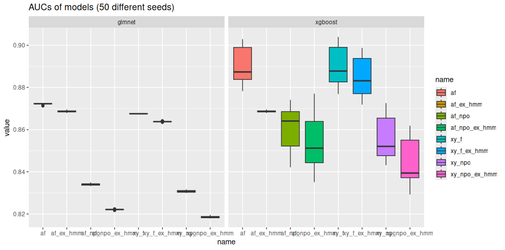
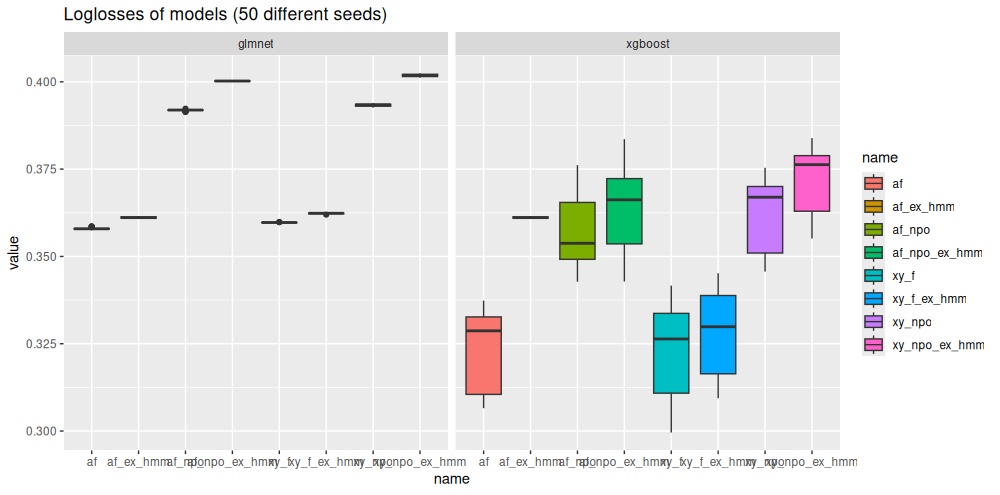

#### <span style="color: grey;"> Submission to metric track </span>

```{r colorize,echo=FALSE}
#| echo: false
# colorize text: use inline as `r colorize(text, color)` to print `text` in a given `color`
# can also be used to color a color name, as in r colorize("red")`
colorize <- function(text, color) {
  if (missing(color)) color <- text
  if (knitr::is_latex_output()) {
    sprintf("\\textcolor{%s}{%s}", color, text)
  } else if (knitr::is_html_output()) {
    sprintf("<span style='color: %s;'>%s</span>", color, text)
  } else text
}
```

```{r setup, echo = FALSE, warning=FALSE, message=FALSE, include=FALSE}
knitr::opts_chunk$set(echo = TRUE)
```

## Introduction
Deciding between man and zone coverage is one of the most critical strategic choices a defensive coordinator must make before each offensive play in American football. While experienced offensive coordinators and quarterbacks often rely on visual cues to identify these defensive schemes, the increasing availability of player tracking data offers a new avenue to uncover and analyze these tactics. A notable example is Amazon's NFL Next Gen Stats model, which delivers coverage predictions during live broadcasts (see a snapshot of the 2024 Week 12 matchup between the Pittsburgh Steelers and Cleveland Browns). However, these models seem to be trained on plays without pre-snap motion, or at least to the situations before motions (see [Amazon](https://aws.amazon.com/de/blogs/machine-learning/identifying-defense-coverage-schemes-in-nfls-next-gen-stats/)), while motion is a crucial element of modern offensive strategies. 

Our project takes this model a step further. While we similarly predict man- or zone coverage when the teams are set before snaps, we further leverage the additional information of pre-snap player movements. Using a hidden Markov model (HMM), we model defenders' trajectories based on hidden states, which represent the offensive players they may be guarding. Incorporating summary statistics of the probabilistic HMM results as features into the existing pre-motion model significantly improves both the AUC and detection accuracy and further allows for evaluating the effectiveness of pre-snap motion in uncovering defensive strategies, providing real-time tactical insights for coaches.

<center>
  
</center>

## Data
We analyze tracking data from nine weeks of the NFL 2022 season, provided by the NFL Big Data Bowl 2024. Beside the tracking data, we also use information on plays and players. We further considered the corresponding data from PFF that assigned the categories \textit{man}, \textit{zone} and \textit{others} representing the different schemes to each play. As it is not properly described what \textit{others} means, we omit every play that is associated with this value. Moreover, we omit plays with more than five offensive linemen and with two quarterbacks. Since we are specifically interested in analyzing pre-snap player movements, we omit plays that did not contain any pre-snap motion. Then, we end up with $3985$ offensive plays in total, from which the defense played $2973$ in zone and $1012$ in man coverage. 

##### Feature engineering
To accurately forecast the defensive scheme (man- or zone defense) for every play, we need to create various features derived from the tracking data. In particular, we conducted the following feature engineering steps: We first consider all 11 players on each side of the field and compute features related to the convex hull of the positions of the players. In particular, for defense and offense, we compute the area spanned by the convex hull of all player such as well as the largest $y$ distance (i.e.\ the width of the hull) and the largest $x$ distance (i.e. the length of the hull). In addition, we select the five most relevant players on each side of the field. For offense, we omit the offensive line and the QB, while, for defense, we omit nose tackles, defensive tackles and defensive ends, and select the five defenders that were the closest to the five attackers corresponding to a weighted euclidean distance, putting much more emphasis on the y-axis. Finally, we use their standardized $x$ and $y$ coordinates as features and order defensive and offensive players according to their $y$ coordinates. Additionally, for each of the relevant defenders, we compute distances to the football and their orientation with respect to the quarterback (`r colorize("values taken at event lineset. Rouven: Die Values haben wir doch rausgenommen aus dem finalen Modell oder? Robert: ich denke das sollten wir noch besprechen. Ich habe ohnehin mehrere Modelle gefitted...","orange")`). Finally, we extract relevant information from play-by-play data, such as quarter, down, yards to go, home and away score and the game clock. 

Detailed information can be found in the Appendix.

## Analysis 

Our analysis comprises different steps:

#### 1. Pre-motion prediction
We train different models to predict whether the defense plays a man- or zone coverage scheme. In particular, we start with fitting a model only using features available pre-motion. Since the aim of the project is to show the effectiveness of pre-snap motion, this allows us to establish a baseline model for detecting zone vs man coverage without motion. 

Since we have a limited dataset available (only 3985 plays), we want to balance the complexity of the model, i.e. we control the number of features available. Using the previously described features, we obtain 67 variables. `r colorize("6 convex hull related features (3 for offense, 3 for defense), 20 player positions features (10 standardized $x$ and $y$ coordinates, 5 for offense, 5 for defense), 30 distance features (10 Euclidian distances, 10 $x$ distances, and 10 $y$ distances to the football), 10 orientation features (5 offense, 5 defense) and 6 play by play features (probably better suited for appendix...)","orange")`. Given the small data set this is rather high number of features and therefore we consider two model classes. On the one hand, we fit an elastic net model, which performs implicit feature selection and is able to handle multicollinearity. On the other hand we use an xgboost model, which is able to capture non linear effects (and interactions) and in general also handles collinearity, but needs careful hyperparameter tuning and generally performs better on bigger data sets.    


#### 2. Hidden Markov model

We describe the movements of the five defensive players during the phase of pre-snap motion by a hidden Markov model (see the Appendix for an in-depth description). In particular, we assume that each defender's $y$-coordinate at each time point $t$ is a realization from a particular Gaussian distribution with mean according to the $y$-coordinate of the offensive player that is currently guarded and an estimated standard deviation. HMMs are particularly useful in this setting as there is no direct knowledge of the guarding allocation. This is only partially observed based on the reaction of the defender to the offenders' movement. Naturally, the model thus treats the information on who is currently guarded as a latent state variable, and hence each observation as a realization from a mixture of Gaussian distributions (see Franks et al. 2015 for a similar approach in basketball).
Ultimately, the goal is to use the fitted model for so-called *state-decoding*, i.e. inferring information on the guarding allocation based on the observations made. For this task, HMMs not only leverage information on the $y$-coordinates of the defender and all offenders potetially guarded at each time point, but also incorporate probabilistic information based on the previous and subsequent observations. For practical details on the model fitting and state decoding, also see the Appendix.

The results of the HMM are exemplified using the following video. It displays a touchdown from the Kansas City Chiefs against the Arizona Cardinals in Week 1 of the 2022 NFL season. We can see that, pre-snap, Mecole Hardman (KC #17) is in motion. He is immediately followed by the defender Marco Wilson (AZ #20), which is a clear indication for man-coverage. 

<center>
<video width="600" height="400" controls>
  <source src="kc_az_td.mp4" type="video/mp4">
</video>
</center>

#### 3. Post-motion prediction
We re-train the pre-motion model to predict whether the defense plays a man- or zone coverage scheme, but, in this step, we incorporate results from the HMM analysis as further features. However, a caveat of the aforemententioned state probabilities is that they constitute as high-dimensional time-series data which makes them hard to use them as features. An outlet of this problem is to employ suitable summary statistics (`r colorize("Robert hier spezifizieren welche du final genommen hast, ich gehe jetzt mal von summe an switches und entropy aus; Robert: Im moment nehmen ich alle 4 (sum, average, nr changes, average ent)... Sollten wir nochmal besprechen.","orange")`). In particular, we calculate for each defender the most likely offensive player $k = 1, \ldots, 5$ to be guarded in each time point $t = 1, \ldots, T_n$. From this, we count the number of state switches and sum these numbers across defenders as a first, simple, summary statistics and further calculate across defenders $j = 1, \ldots, 5$ the mean entropy in offensive play $n = 1,\ldots, N$, i.e.: 

$$H(n) = - \frac{1}{5}\sum_{j = 1}^5 \sum_{k=1}^{5} \left( \frac{1}{T_n} \sum_{t=1}^{T_n} \mathbb{1}\left(\arg\max_{i=1,\ldots,5} X_{t,i} = k\right) \cdot \log\left(\frac{1}{T_n} \sum_{t=1}^{T_n} \mathbb{1}\left(\arg\max_{i=1,\ldots,5} X_{t,i} = k\right)\right) \right).$$
Entropy is a measure of uncertainty or randomness in a probability distribution, here, the empirical distribution of the defenders guarding the respective offensive players. Higher entropy indicates greater unpredictability, while lower entropy signifies more predictability.

## Results

By comparing the predictive performance of our model without motion and our post-motion model we can determine the effectiveness of player movements before the snap to detect the correct defensive scheme. Moreover, we assess which teams predominantly apply pre-snap motions to increase the likelihood of correctly identifying the applied defensive strategy.

auc da unbalanced data
Hier die Animation rein mit den Verbindungen von den decodierten States 




LEGENDE INFO:

- Model af: alle features im model (pre motion mit distances und orientation, hmm features (average,sum,nr changes, average ent), naive postmotion, pbp)
- Model af_ex_hmm: alle features außer hmm features (pre motion mit distances und orientation, naive postmotion, pbp)
- Model af_npo: alle features außer naive postmotion features
- Model af_npo_ex_hmm: alle features außer naive postmotion features und hmm features
- Model xy_f: premotion features nur x,y coords der spieler (keine distances und orientation), sonst alle features
- Model xy_f_ex_hmm: wie xy_f, nur ohne hmm features
- Model xy_npo: wie xy_f, nur ohne naive postmotion features
- Model xy_npo_ex_hmm: wie xy_npo, nur ohne hmm features


robustheit checken mit simplen summarys nach der motion

tests mit conditional independence (vllt in Anhang)

team analysen

## Discussion

While we were clearly able to show that motion enables the defensive coverage scheme, a limitation of our approach lies in the imperfect prediction accuracy of the pre-motion model, primarily due to insufficient hyperparameter tuning and the relatively small number of plays involving motion. However, the primary focus of this project was on pre-snap motion, particularly on how to effectively translate this information into the hidden Markov model. Importantly, our pre-motion model is modular and can be seamlessly replaced by another model, such as the NFL Next Gen Stats model, which can then be integrated into our modeling extension to fully leverage the insights provided by our extention.

## Code

All code for data pre-processing, model training, prediction and player evaluation can be found [here](https://github.com/janoleko/BDB-2025/).

## References
*Franks A, Miller A, Bornn L, Goldsberry K (2015). Characterizing the Spatial Structure of Defensive Skill in Professional Basketball. The Annals of Applied Statistics, 9(1), DOI:10.1214/14-AOAS799

*Koslik J (2024). LaMa: Fast Numerical Maximum Likelihood Estimation for Latent Markov Models. R package version 2.0.2, <https://CRAN.R-project.org/package=LaMa>.

*Zucchini W, MacDonald I, Langrock R (2016). Hidden Markov Models for Time Series - An Introduction Using R. CRC Press

## Appendix

#### Hidden Markov model

A hidden Markov model consists of an observed time series $\{\boldsymbol{y}_t\}_{t=1}^T$ and an unobserved first-order Markov chain $\{ g_t\}_{t=1}^T$, with $g_t \in \{1,\ldots,N\}$. In this case, at every time point $t$, $\boldsymbol{y}_t$ is the y-coordinate of the defensive player and $g_t$ proxies the offensives player to be guarded, i.e. the guarding allocation. 
The Markov chain is fully described by an initial distribution $\boldsymbol{\delta}^{(1)} = \bigl( \Pr(g_1=1), \ldots, \Pr(g_1=N) \bigr)$ and a transition probability matrix (t.p.m.) $\boldsymbol{\Gamma} = (\gamma_{ij})$, with $\gamma_{ij} = \Pr(g_t = j \mid g_{t-1} = i), \ i,j = 1, \ldots, N$. The connection of both stochastic processes arises from the assumption that the distribution of the observations $\boldsymbol{y}_t$ are fully determined by the state that is currently active. More formally,
\begin{equation*}
f(\boldsymbol{y}_t \mid g_1, \ldots, g_T, \boldsymbol{y}_1, \ldots, \boldsymbol{y}_{t-1},\boldsymbol{y}_{t+1},\ldots,\boldsymbol{y}_T) = f(\boldsymbol{y}_t \mid g_t = j), \qquad j \in \{1, \ldots, N\},
\end{equation*}
which we denote by $f_j(\boldsymbol{y}_t)$ in short.
In general, $f_j$ can be any density or probability mass function depending on the type of data and a typical choice is a parametric distribution with separate parameters for each latent state. Following the approaches of Franks et al. (2015), we opt for a Gaussian distribution with a mean that is fully determined by the current $y$-coordinate of defender $j \in \{1, \dots, N\}$ and a standard deviation that is fixed accross all states but estimated from the data.

To fit the model, we use direct numerical likelihood maximization. The HMM likelihood for the motion of a specific defender in a specific play can be calculated based on the so-called *forward algorithm*. It effectively performs a summation over all possible latent state sequences in an efficient manner, rendering the computational complexity linear in the number of observations. Time series of different defenders within the same play, and of different plays are treated as independent, hence their likelihood contributions are summed to obtain the full likelihood of the training data. For practical implementation, we wrote a custom likelihood function in R, using the function `forward()` and other convenience functions from the R package `LaMa` (Koslik, 2024) to speed up computations. Furthermore, we used the R package `RTMB` to make this likelihood function compatible with automatic differentiation, making the numerical optimization process more efficient and robust. 
The parameters to be estimated are only the transition probability matrix $\boldsymbol{\Gamma}$ and the standard deviation of the Gaussian distribution. 
The initial distribution of each defender for each play is fixed and computed based on ... ROUVEN

Having fitted an HMM to the data, we can use the model to predict the underlying state sequence based on the observations. This process is called state decoding and two main approaches exist. So-called *local decoding* constructs the conditional distributions
$$
\Pr(g_t = j \mid \boldsymbol{y}_1, \dots, \boldsymbol{y}_T)
$$
while *global decoding* using the *Viterbi-algorithm* finds the state sequence that maximizes the joint probability of the state sequence given the observations. Local decoding retains more probabilistic information as it provides a categorical state distribution for each time point while global decoding is more suitable for visualization purposes as it provides a single state sequence that is most likely to have generated the observations.
To obtain both the local state probabilities and the global state sequence, we used the functions `stateprobs()` and `viterbi()` that are also contained in the R package `LaMa`.
